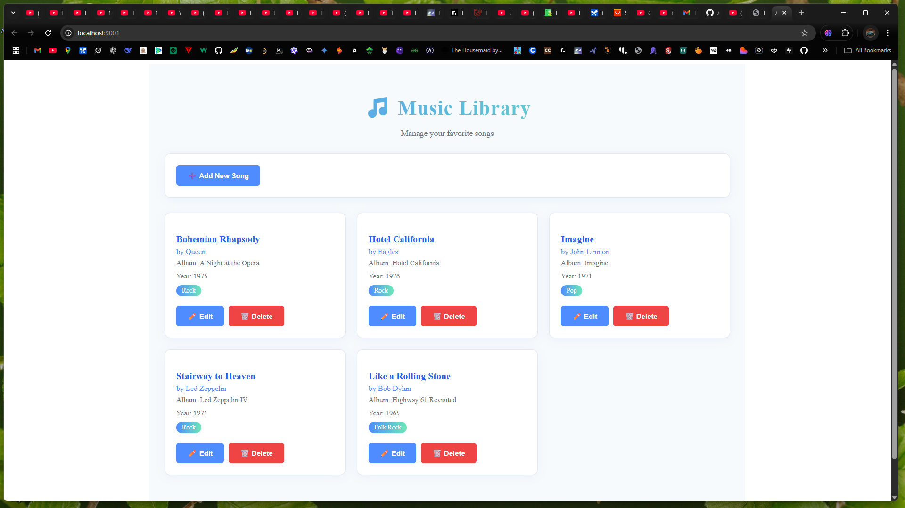

# 🎵 Music Library App

A modern full-stack application to manage your favorite songs, built with **React**, **Redux Toolkit**, **Redux-Saga**, **Emotion** (for theming), and a custom **Node/Express** backend.

---

## 🚀 Features

- 🎶 Paginated, searchable list of songs (title, artist, album, year, genre)
- ✍️ Full CRUD (Create, Read, Update, Delete) via REST API
- 🎨 Beautiful, responsive UI with Emotion theming and transitions
- 🛠️ Manual Webpack configuration (no CRA)
- ⚡ State management with Redux Toolkit & Redux-Saga
- 🧪 Unit & component tests (Jest, React Testing Library)
- 🧑‍💻 Simple Node/Express backend (in-memory storage)

---

## ⚙️ Setup Instructions

### 1️⃣ Backend

```bash
cd backend
npm install
node index.js
```

- Runs at: [http://localhost:4000](http://localhost:4000)

### 2️⃣ Frontend

```bash
npm install
npx webpack serve --port 3001
```

- Runs at: [http://localhost:3001](http://localhost:3001)

---

## 🤖 AI Usage

- **AI was used for:**
  - Generating and refactoring code for best practices
  - Creating and updating tests
  - Improving UI/UX with Emotion and transitions
  - Writing and formatting this README
- **Testing:** AI-generated tests and manual test cases were used to verify all features.

---

## 🧪 Testing

- **Unit Tests:** Located in `src/App.test.js` and backend `index.test.js`
- **Component Test:** Uses [React Testing Library](https://testing-library.com/docs/react-testing-library/intro/)
- **Run all tests:**
  ```bash
  npm test
  # or for backend
  cd backend && npm test
  ```
- **Sample Test (frontend):**
  ```js
  test("renders project title", () => {
    render(<App />);
    expect(screen.getByText(/Music Library/i)).toBeInTheDocument();
  });
  ```

---

## 📦 Webpack Setup Explained

- **Manual config:** See `webpack.config.js` for all settings
- **Key features:**
  - Babel for JSX/ESNext
  - CSS & image loaders
  - HtmlWebpackPlugin for HTML template
  - dotenv-webpack for environment variables
  - Dev server runs on port 3001 (changeable)
  - Supports hot reload, history fallback, and static assets
- **Why manual?**
  - Full control over build, no hidden magic
  - Easy to extend for advanced features

---

## 🧑‍🔬 How I Verified the Code

- ✅ Ran all unit/component tests (Jest, React Testing Library)
- ✅ Manually tested all CRUD operations in the browser
- ✅ Verified API endpoints with browser and Postman
- ✅ Debugged with browser dev tools and backend console logs
- ✅ Checked responsive design on mobile/tablet/desktop

---

## 📚 API Documentation

### Base URL

```
http://localhost:4000
```

### Endpoints

#### 🔍 `GET /songs`

- Query params: `page` (default: 1), `limit` (default: 10)
- **Response:**
  ```json
  {
    "list": [
      { "id": 1, "title": "Imagine", "artist": "John Lennon", ... },
      ...
    ],
    "page": 1,
    "totalPages": 1
  }
  ```

#### ➕ `POST /songs`

- **Body:**
  ```json
  {
    "title": "Song Title",
    "artist": "Artist",
    "album": "Album",
    "year": 2024,
    "genre": "Pop"
  }
  ```
- **Response:** Created song object

#### 📝 `PUT /songs/:id`

- **Body:**
  ```json
  { "title": "New Title", "artist": "New Artist", ... }
  ```
- **Response:** Updated song object

#### 🗑️ `DELETE /songs/:id`

- **Response:** 204 No Content

---

## 📝 Notes

- All data is stored in-memory (restarts will reset the song list)
- CORS is enabled for local frontend-backend communication
- For more details, see code comments and source files

---

## 👀 Quick Preview



---

> _Made with ❤️ using React, Redux, Emotion, Node, and AI-powered best practices._
